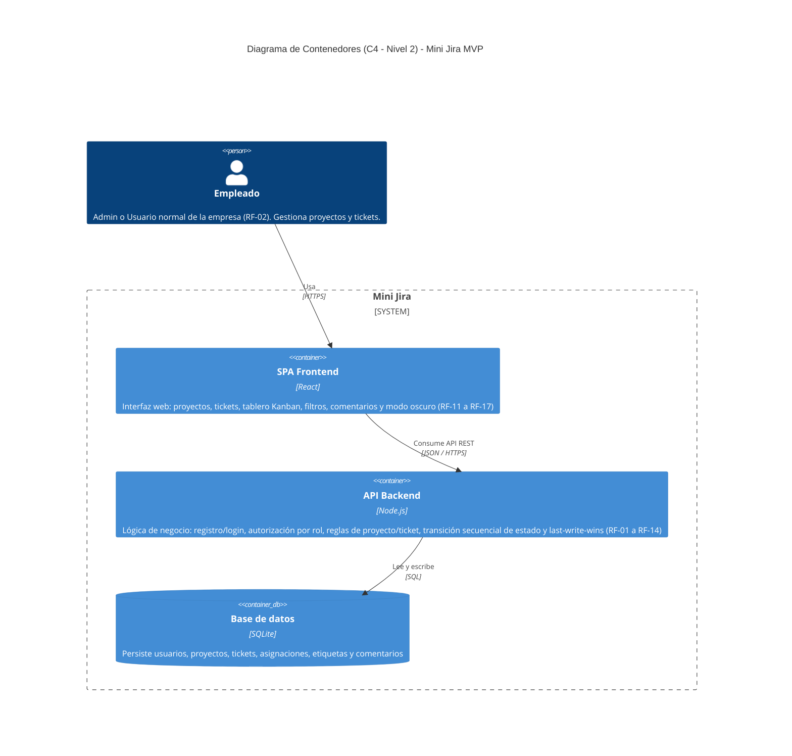
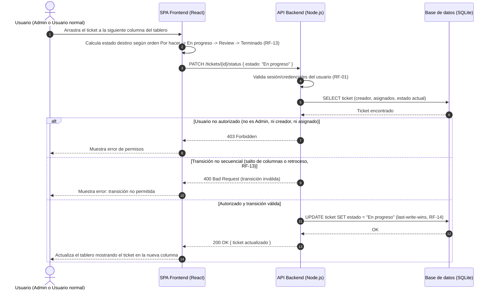

# Arquitectura — Mini Jira (MVP)

**Fuente:** `docs/specs.md` (sección 3, Stack Tecnológico; requerimientos funcionales RF-01 a RF-19) y `docs/backlog.md`.
**Alcance:** Este documento no introduce contenedores ni servicios que no estén respaldados por el stack declarado en specs.md (React / Node.js / SQLite). No se incluyen colas, cachés, servicios de notificación por email ni microservicios adicionales, ya que están fuera de alcance del MVP (RF-18, RF-19).

---

## 1. Diagrama de Contenedores (C4 — Nivel 2 / HLD)

Deriva directamente de la sección "3. Stack Tecnológico" de `specs.md`: una SPA en React, un backend en Node.js que concentra toda la lógica de negocio (autenticación, autorización por rol, reglas de transición de tablero, resolución last-write-wins) y una base de datos relacional SQLite.

**Notas de diseño:**
- No existe un contenedor de "servicio de autenticación" separado: RF-01 no especifica un proveedor externo (OAuth, IdP), por lo que la autenticación vive dentro del único backend Node.js.
- No se incluye un contenedor de notificaciones/email ni de métricas: RF-18 y RF-19 están explícitamente fuera de alcance del MVP.
- SQLite se modela como `ContainerDb` embebido en el mismo proceso/servidor que la API, consistente con el supuesto de baja concurrencia (~10 empleados, sin requisitos de escalabilidad horizontal).

---

## 2. Diagrama de Secuencia (LLD) — Historia 9: Tablero Kanban con transición secuencial obligatoria

Se eligió la **Historia 9** (`docs/backlog.md`) como la más representativa porque combina, en un único flujo, autorización por rol (RF-03/RF-04), una regla de negocio central del producto (transición secuencial obligatoria del tablero, RF-13) y la política de concurrencia del MVP (last-write-wins, RF-14), atravesando las tres capas: frontend, API y datos.

**Notas de diseño:**
- El rechazo de saltos de columna y de retrocesos se modela como ramas explícitas del `alt`, reflejando los escenarios de fallo deducidos en la Historia 9 (`docs/backlog.md`, líneas 268-277).
- La actualización en base de datos no incluye bloqueo optimista ni verificación de versión, conforme a RF-14 (last-write-wins sin aviso de conflicto).
