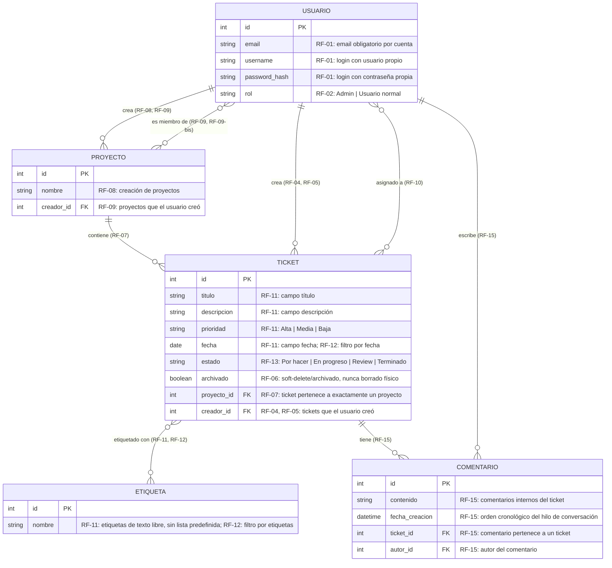

# Diagrama Entidad-Relación — Mini Jira (MVP)

**Fuente:** `docs/specs.md` (secciones 5 y 6, Requerimientos Funcionales RF-01 a RF-19) y `architecture/architecture.md`.
**Alcance:** Este documento modela únicamente las entidades, atributos y relaciones que se desprenden directamente de un requerimiento de `specs.md`. No se incluyen entidades de fases posteriores (notificaciones por email, RF-18; métricas de dashboard, RF-19) ni tablas de infraestructura no mencionadas en el PRD. No se genera SQL ni se define motor de base de datos concreto en este documento.

---

## 1. Diagrama Entidad-Relación (conceptual)

---

## 2. Trazabilidad Entidad ↔ Requerimiento

| Entidad | Justificación (specs.md) |
|---|---|
| `USUARIO` | RF-01 (registro/login con email obligatorio), RF-02 (roles Admin / Usuario normal) |
| `PROYECTO` | RF-08 (creación de proyectos por cualquier rol), RF-09/RF-09-bis (visibilidad y membresía) |
| `TICKET` | RF-07 (pertenece a un proyecto), RF-11 (campos del ticket), RF-13 (estados del tablero) |
| `ETIQUETA` | RF-11 (campo etiquetas, texto libre), RF-12 (filtro por etiquetas) |
| `COMENTARIO` | RF-15 (comentarios internos / hilo de conversación dentro del ticket) |

## 3. Trazabilidad Relación ↔ Requerimiento

| Relación | Cardinalidad | Justificación (specs.md) |
|---|---|---|
| Usuario crea Proyecto | 1:N | RF-08 (cualquier rol crea proyectos), RF-09 (un usuario ve los proyectos "que creó") |
| Usuario es miembro de Proyecto | N:N | RF-09 (usuario normal ve proyectos "a los que fue asignado"), RF-09-bis (membresía asignada por el creador del proyecto o por un Admin) |
| Proyecto contiene Ticket | 1:N | RF-07 (relación uno a muchos proyecto→ticket) |
| Usuario crea Ticket | 1:N | RF-04, RF-05 (permisos sobre tickets "que creó") |
| Usuario asignado a Ticket | N:N | RF-10 (múltiples personas asignadas simultáneamente a un ticket) |
| Ticket etiquetado con Etiqueta | N:N | RF-11 (campo etiquetas, plural), RF-12 (filtrado de tickets por etiqueta) |
| Usuario escribe Comentario | 1:N | RF-15 (autor del comentario dentro del ticket) |
| Ticket tiene Comentario | 1:N | RF-15 (hilo de comentarios internos del ticket) |

**Notas de diseño:**
- `rol`, `prioridad` y `estado` se modelan como atributos (valores fijos/enumerados) y no como entidades separadas, ya que `specs.md` no describe ningún atributo adicional propio de esos valores (RF-02, RF-11, RF-13).
- La relación de asignación de responsables al ticket (RF-11: campo "responsable(s)") se representa mediante la relación N:N `Usuario asignado a Ticket` (RF-10), y no como un atributo escalar, porque un ticket admite múltiples responsables simultáneos.
- No se modela ningún atributo de versión/timestamp de actualización en `TICKET` para la resolución de conflictos: RF-14 (last-write-wins) es una regla de comportamiento de escritura, no un dato persistido según lo descrito en `specs.md`.
- `archivado` en `TICKET` refleja el soft-delete de RF-06; no existe un atributo equivalente en `PROYECTO` porque `specs.md` no describe borrado/archivado de proyectos.
- Quedan fuera de este diagrama las entidades de notificaciones (RF-18) y de métricas/dashboard (RF-19) por estar explícitamente fuera de alcance del MVP.
